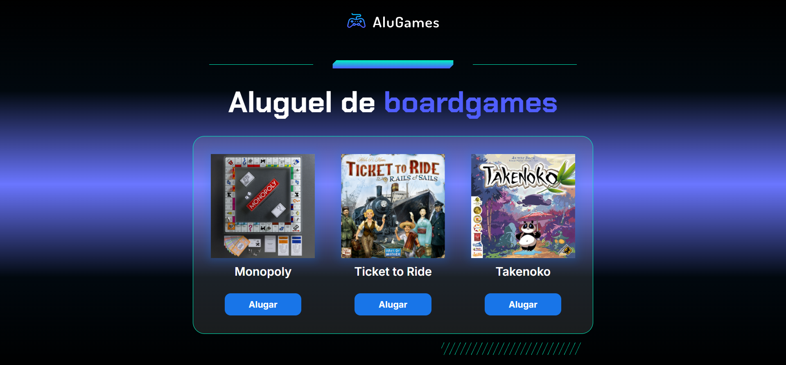

<h1 align="center"> AluGames </h1>

<p align="center">
  
  
</p>

<p align="center">
  
</p>

## 💻 Sobre o projeto

O **AluGames** é uma aplicação front-end desenvolvida para simular um painel de aluguel de jogos de tabuleiro. O objetivo principal deste projeto foi praticar lógica de programação com JavaScript, especificamente a manipulação de elementos do DOM (Document Object Model) e controle de estados visuais.

Este projeto faz parte da minha jornada de aprendizado em desenvolvimento web e construção de portfólio.

## ⚙️ Funcionalidades

- **Alteração de Status:** Ao clicar no botão, o jogo alterna entre "Alugado" e "Disponível".
- **Feedback Visual:** - Jogos alugados recebem uma sobreposição escura na imagem.
  - O botão muda de cor e texto (de "Alugar" para "Devolver").
- **Interatividade:** A lógica garante que as classes CSS sejam trocadas corretamente sem quebrar o layout.

## 🛠 Tecnologias Utilizadas

- **HTML5:** Estrutura semântica da página.
- **CSS3:** Estilização, uso de gradientes e responsividade básica.
- **JavaScript:** Lógica de interação, funções e condicionais (`if/else`).
- **Git e GitHub:** Versionamento de código.

## 🚀 Como executar o projeto

1. Clone o repositório:
```bash
git clone [[https://github.com/SEU-USUARIO/alugames.git]](https://github.com/JoaoPedroFernandes1337/Alu-Games.git)
